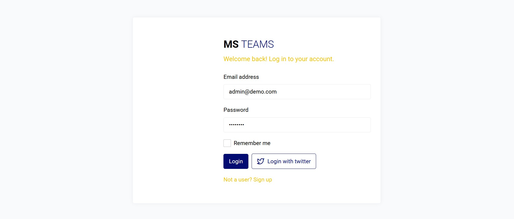
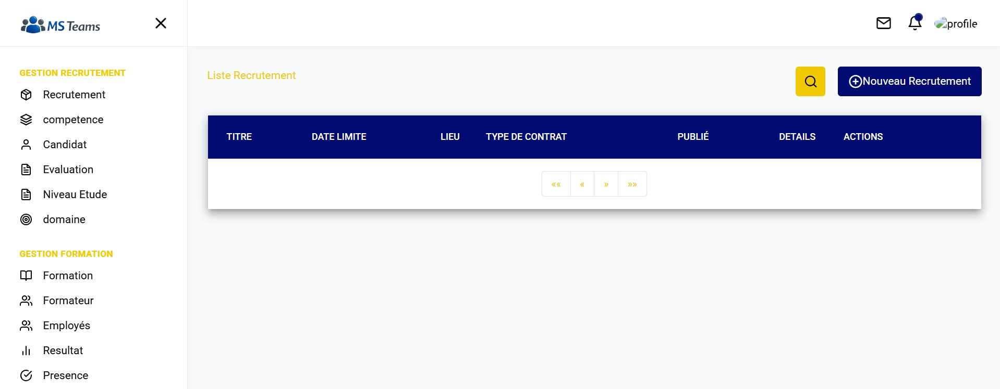
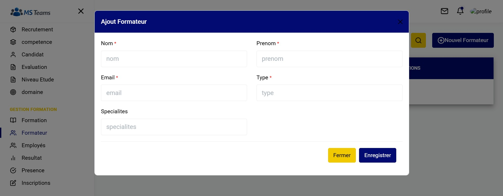

# MS-TEAMS - Plateforme de Gestion des Talents

[](https://www.java.com)
[](https://spring.io/projects/spring-boot)
[](https://angular.io)
[](https://opensource.org/licenses/MIT)

## 📋 Aperçu

**MS-TEAMS** est une application web full-stack dédiée à la **Gestion des Talents et des Processus RH**, développée de manière autonome par une équipe de stagiaires dans le cadre d'un projet d'équipe réel visant à monter en compétences techniques.

Cette plateforme optimise les workflows RH et formation : gestion des candidats, candidatures, évaluations de compétences, recrutements, sessions de formation, présences, résultats, etc. Construite avec des technologies d'entreprise modernes, elle illustre les meilleures pratiques en développement full-stack.

**Points forts** :
- Développement autonome par stagiaires sans supervision externe.
- Frontend Angular modulaire avec services dédiés par domaine.
- Backend Spring Boot robuste avec APIs RESTful.
- Structure production-ready (guards d'auth, gestion d'erreurs, spinners, etc.).

Parfaite pour les recruteurs évaluant les compétences d'internes/équipes ou les développeurs explorant des solutions RH scalables.

## ✨ Fonctionnalités (Inférées du Code)

- **Gestion des Candidats** : Opérations CRUD (`candidat.service`).
- **Candidatures** : Suivi avec statuts (`candidature.service`, `statut-candidature.enum.ts`).
- **Compétences & Domaines** : Gestion (`competence.service`, `domaine.service`).
- **Recrutements** : Workflows (`recrutement.service`).
- **Formations** : Sessions, inscriptions, présences, résultats (`formation.service`, `sessionFormation`, `inscription`, `presence`, `resultat`).
- **Évaluations** : Employés et stagiaires (`evaluation.service`).
- **Utilisateurs & Rôles** : Employés (`employe`), formateurs (`formateur`), guards d'auth (`auth.guard.ts`).
- **Composants UI** : Layout responsive, navbar/sidebar, spinner, alertes, pipes safe.
- **Autres** : Modules, niveaux d'études (`niveauEtude`), tests (`test.service`).

## 🛠️ Stack Technique

| Couche      | Technologies                          |
|-------------|---------------------------------------|
| **Backend** | Java 17+, Spring Boot 3+, Maven, YAML |
| **Frontend**| Angular 17+, TypeScript, SCSS, RxJS  |
| **Build**   | Maven, npm/Angular CLI                |
| **Autres**  | Feather Icons, Proxy Config (dev)     |

## Interfaces cle

### LoginInterface


### Recrutementnterface


### Formulaire


## 🏗️ Architecture

```
MS-TEAMS (Monorepo)
├── backend-ms-teams/          # API Spring Boot REST (port 8080)
│   ├── src/main/java/com/webgram/  # Contrôleurs, Services, Entités
│   ├── src/main/resources/application.yml
│   └── pom.xml
└── frontend-ms-teams/         # SPA Angular (port 4200)
    ├── src/app/services/      # Services par domaine (ex: candidat.service.ts)
    ├── src/app/views/         # Pages : auth, gestion-formation, gestion-recrutements
    ├── src/app/core/          # Guards, icônes, données dummy
    ├── angular.json
    └── package.json
```

- **Communication** : Frontend proxifie les appels API vers backend via `proxy.conf.json`.
- **Sécurité** : Guards d'authentification, accès basé sur rôles (`Authority.ts`).

## 🚀 Prérequis & Installation Locale

### Prérequis
- Java 17+ & Maven 3.6+
- Node.js 18+ & npm 9+ (ou yarn)
- IDE : IntelliJ/VSCode

### Backend
```bash
cd backend-ms-teams
mvn clean install
mvn spring-boot:run  # Démarre sur http://localhost:8080
```

### Frontend
```bash
cd frontend-ms-teams
npm install
ng serve             # Démarre sur http://localhost:4200 (proxifie backend)
```

**Stack Complète** : Démarrer backend d'abord, puis frontend. Accès : `http://localhost:4200`.

**Build Production** :
- Backend : `mvn clean package` → `target/*.jar`
- Frontend : `ng build --prod` → `dist/`.

## 👥 Contexte du Projet

Projet réalisé **autonomement par une équipe de stagiaires** durant leur formation. Il démontre :
- Collaboration d'équipe (monorepo partagé).
- Cycle complet : conception, implémentation, tests.
- Patterns d'entreprise : services, modules, enums, utils.

Sans frameworks externes ; focus sur montée en compétences.

## 🤝 Contribution

1. Forker le repo.
2. Créer branche feature (`git checkout -b feature/Fonctionnalite`).
3. Commit (`git commit -m 'Ajout Fonctionnalite'`).
4. Pousser & PR.

Signaler bugs via GitHub Issues.

## 📄 Licence

Projet sous licence MIT. Voir [LICENSE](LICENSE) (à ajouter si besoin).

## 🙌 Remerciements

- Équipe stagiaires agence webgram pour la réalisation autonome.
  - Groupe 3 :
    - Ahmed Combo Rachad
    - Babacar Diop
    - Emillie
    - Marie Sar
- Open-source : Angular, Spring Boot, Feather Icons.

---

*Développé avec ❤️ pour la montée en compétences. Questions ? Ouvrir une issue !*

